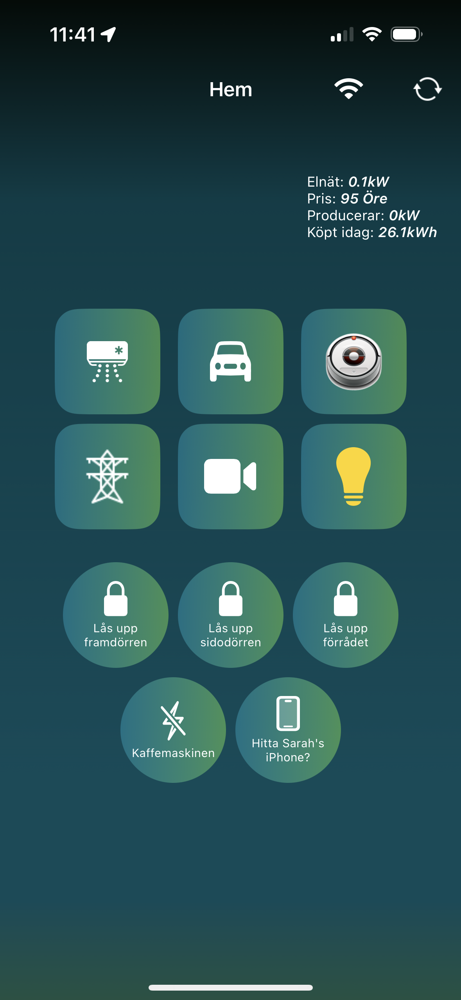
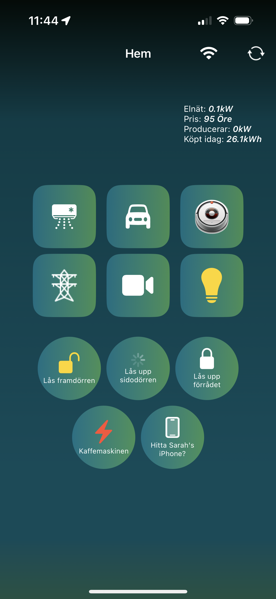
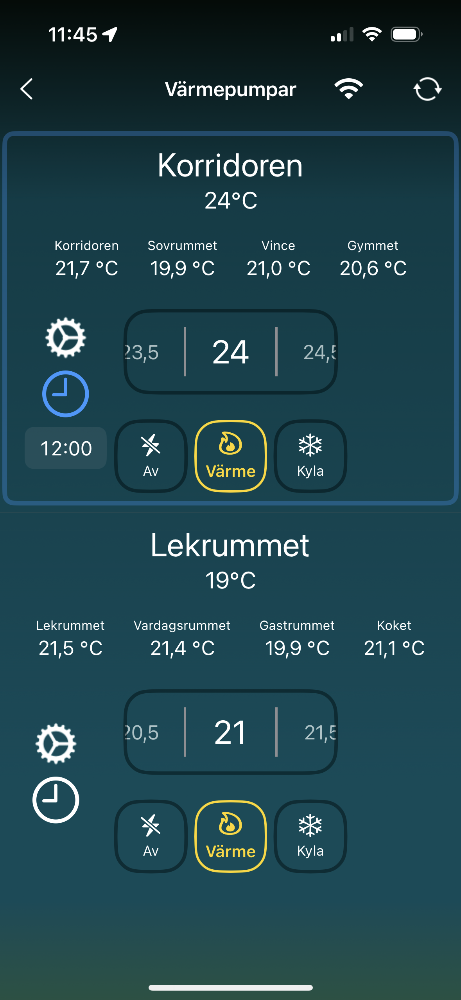
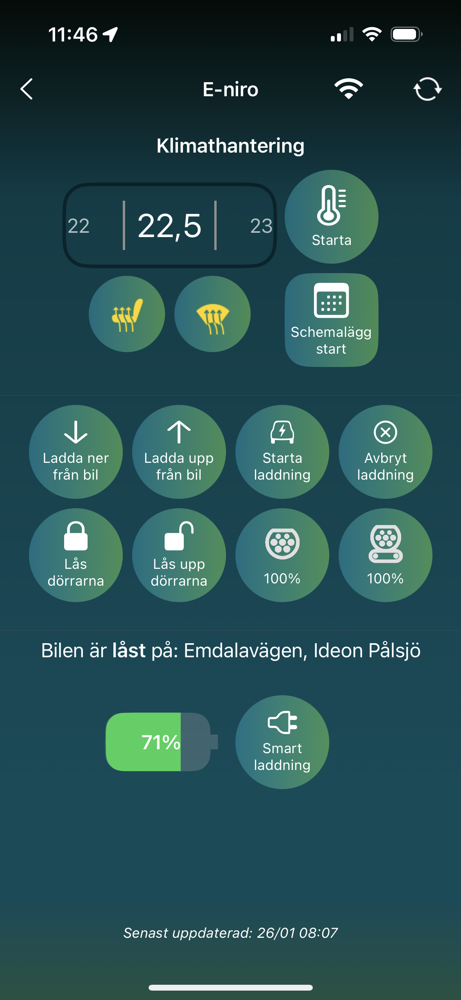
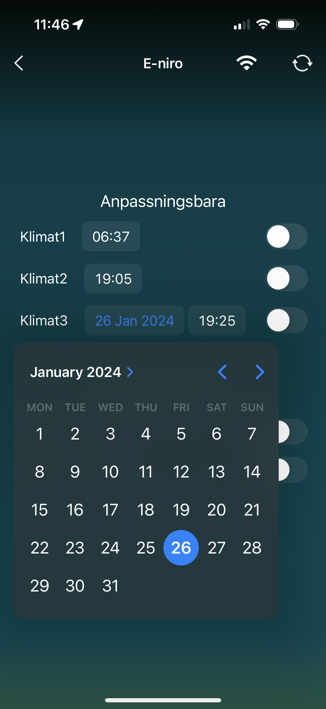
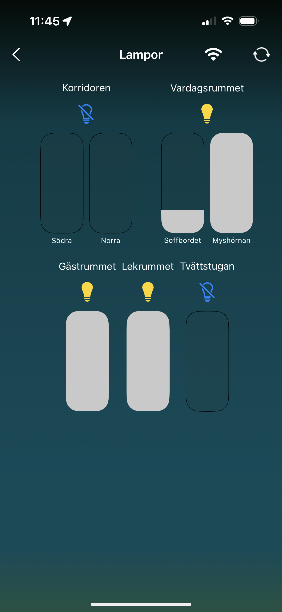

# IntelliNest

## Description

IntelliNest is a native iOS application that leverages the power of the popular open-source home automation platform, Home Assistant, to control various smart home devices. It aims to replace the web-based Home Assitant app. The application is written in Swift/SwiftUI. I hope that this repo will help you create your own native iOS app, I think the easiest approach is to familiarise yourself with this repo and then remove the views/viewmodels and start building your own based on the same architecture as this app. With chatGPT, I think this would be doable even if you are not an iOS developer but will need some software development experience.

## Code statistics
| Indicators                          | Now  | Desired |
|-------------------------------------|------|---------|
| Total LOC                           | 10958 | N/A |
| Swift file count                    | 161 | N/A |
| Average LOC per file                | 68 | <100 |
| TODO comment count                  | 0 | 0 |
| FIX comment count                   | 0 | 0 |
| unowned reference count             | 0 | 0 |
| Commit count in main                | 67 | N/A |
| Total deleted lines                 | 5469 | N/A |
| Total added lines                   | 20017 | N/A |

Last Updated: 2024-02-01
## Supported features
### Rest API and Websocket support
Most views now use WebSocket instead of REST API for improved real-time updates.
### Dynamic connection
Changing between local and remote connection depending on if counter.test88338833 is accessible or not using the local url
### Door locks & smart outlet
Toggle door locks with loading animation and toggle smart outlets.
 

  
  
 

### Heaters
 Controlling heaters functionality - Temperature, mode, fan, vertical and horisontal direction and timer functionality.
 

  
  
  
 

 
### Car
Climate handling and scheduling, refresh data, start/stop charging, lock/unlock doors and charger limit and battery info.
 

  
  
 

 
### Roborock
Info since the trash was emptied, map view start/paus, dock, locate and send to bin. Also buttons for each room (organized by floor plan)
 

  
  
 

 
### CCTV
Using snapshot images 4 fps. Tap to fullscreen and zoomable.

Note: Fully implemented support to use VLCMediaKit but the loading times were too long and Pod is currently not installed. It supports rtsp while using the local connection and HLS through home assistant remote connection otherwise.
 

  
  
 

 
### Lights
Sliders to set the brightness, tappable sliders, and bulb button above each room.
 

  
 

 
### Widgets
Launch home screen or start car climate
 

  
 

### NFC tags
Set up automation in Shortcuts that call the intent in app (Storage lock and toggle monitor)
### User management
Used for logging and custom views
### Remote logging
ShipBookSDK log function extended to always include which user it was that logged

## Getting Started
1. Clone the repository using `git clone https://github.com/TobiasLaross/IntelliNest.git`
2. Open the project in Xcode
3. Replace the bundle identifier to match yours (and optionally app name)
4. Create a file named IntelliNest-Info.xcconfig and paste in the contents from Github-Info.xcconfig, you will modify the contents based on what functionality you will use.
5. Update the entityIds with your entities and remove the ones you don't want to use.
6. Modify the HomeView according to your needs.
7. Use the compiler to find the parts you are missing or the classes you need to delete.
9. Run the project on your preferred iOS simulator or device

## Contributions
IntelliNest is an open-source project and welcomes contributions. Please feel free to fork the repository and submit pull requests for any enhancements or features you think are useful. Try to make contribution generic enough or specific for this project that others might find useful.
A thank you to [@alexEkdahl](https://github.com/alexEkdahl) for suggesting the name 'IntelliNest'.

## Licensing
IntelliNest is licensed under the terms of the MIT license. This license grants permission for the software to be used, copied, modified, merged, published, distributed, sublicensed, and/or sold.
| Indicators                          | Now  | Desired |
|-------------------------------------|------|---------|
| Total LOC                           | 9015 | N/A |
| Swift file count                    | 131 | N/A |
| Average LOC per file                | 68 | <100 |
| TODO comment count                  | 0 | 0 |
| FIX comment count                   | 0 | 0 |
| Optional force unwrap (!) count     | 3 | 0 |
| unowned reference count             | 0 | 0 |
| Max indentation level               | 21 | <=5 |
